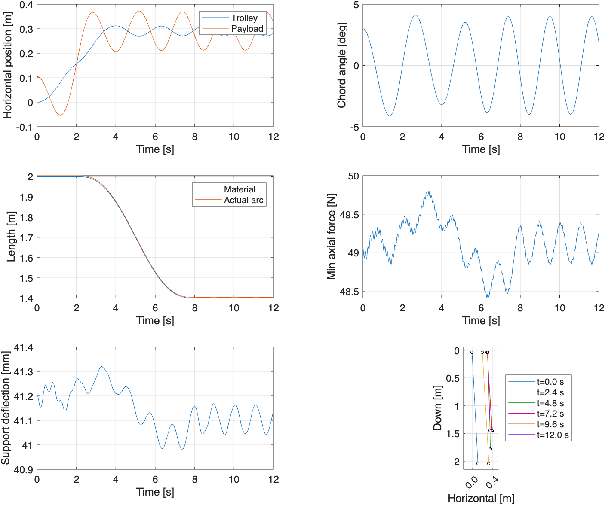

# 二维 ALE-ANCF 变长度柔性绳塔吊模型说明书

**中文版 · 版本 1.1 · 2026-09-28**  
适用项目：TowerCrane-OptimalControl  
对应代码基线：`6cab2e5`  
[日本語版](model_manual_ja.md)

## 1. 用途与模型定位

本模型用于分析二维平面内塔吊小车运动、吊点竖向振动、柔性绳变长度运动及吊物摆动之间的耦合。它适合作为动力学研究、参数分析及后续控制器设计的仿真基础。目前的小车力和收放绳轨迹均为预先给定的开环输入，尚未实现消摆控制或最优控制。

ALE 表示任意拉格朗日—欧拉描述；ANCF 表示绝对节点坐标法。ANCF 用节点位置和位置梯度表示柔性绳形状，ALE 允许计算节点相对绳材料移动，从而描述绳材料通过顶端进入或离开计算区域的过程。

本实现参考 Li 等人（2022）的 ALE-ANCF 吊索建模思路，采用**二维、规定材料坐标、固定单元数量的移动网格**。塔身和吊臂仍由一个竖向弹簧—阻尼支撑近似，并非论文整套有限元模型的复现。

### 已包含与未包含的内容

| 已包含 | 尚未包含 |
|---|---|
| 绳索分布质量、轴向伸长及弯曲弹性 | 三维回转和面外摆动 |
| 非线性几何与大角度平面摆动 | 完整塔身、吊臂梁有限元及移动滑动副 |
| 规定收放绳运动及附加 ALE 惯性 | 卷扬电机、卷筒和绳轮接触 |
| 吊点竖向弹性与支撑阻尼 | 绳内阻尼、松绳后的运动和重新张紧冲击 |
| 小车水平驱动力与重力 | 闭环消摆、最优控制和自动单元拆分/合并 |

示例参数为演示用有效参数，未由实机或论文参数标定。大角度运动不等于材料可承受任意大应变；轴向本构仍是线弹性关系。

## 2. 系统组成、坐标与自由度

系统由顶端小车/吊点集总质量 `mT`、竖向支撑 `kB,cB`、柔性绳及底端吊物质点 `mP` 构成。顶端仅在竖向有支撑弹簧；水平位置由动力学方程求解，没有水平位置伺服约束。

水平向右为 `x` 正方向，竖直向下为 `y` 正方向。吊点竖向位移记为 `d`，从未加载的支撑位置量起，包含重力静挠度。正摆角表示吊物位于吊点右侧。

设绳有 `n_e` 个单元、`n_e+1` 个节点。节点编号为 `i=0,...,n_e`，每个节点的机械坐标为：

$$
\begin{gathered}
\mathbf{q}_i=\left[x_i,\ y_i,\ x_{s,i},\ y_{s,i}\right]^{\mathsf{T}} \\
\mathbf{q}=\left[\mathbf{q}_0^{\mathsf{T}},\ \mathbf{q}_1^{\mathsf{T}},\ \ldots,\ \mathbf{q}_{n_e}^{\mathsf{T}}\right]^{\mathsf{T}} \\
\mathbf{z}=\left[\mathbf{q}^{\mathsf{T}},\ \dot{\mathbf{q}}^{\mathsf{T}}\right]^{\mathsf{T}}
\end{gathered}
$$

`x_s,y_s` 是位置对未伸长材料坐标 `s` 的导数，量纲为 m/m。其模长包含伸长信息，**不能归一化为单位切向量**。`qdot` 中斜率分量是斜率的时间导数，不是节点角速度。

相邻单元共享位置与斜率，中心线具有 C1 连续性。顶端位置与小车/支撑共享坐标，底端位置与吊物共享坐标；端部斜率自由，不施加固定方向约束或外加端弯矩。

机械坐标数为 `4(n_e+1)`，一阶状态数为 `8(n_e+1)`。默认 3 个单元、4 个节点，对应 16 个机械坐标和 32 个一阶状态。材料坐标由输入规定，不计入上述未知量。

## 3. 三种长度与移动材料网格

必须区分以下长度：

| 量 | 含义 | 决定方式 |
|---|---|---|
| `L(t)` | 计算域内未伸长材料长度 | 由卷扬输入规定 |
| `arcLength(t)` | 受力后绳中心线的实际弧长 | 对变形后的中心线积分 |
| 吊点—吊物距离 | 两端位置之间的直线距离 | 由端点坐标计算 |

弯曲时弧长与两端直线距离不同；轴向伸长使实际弧长与材料长度不同。当前网格为：

$$
\begin{gathered}
s_i(t)=\left(-1+\frac{i}{n_e}\right)L(t),\qquad i=0,\ldots,n_e \\
s_0(t)=-L(t),\qquad s_{n_e}(t)=0,\qquad \ell_e(t)=\frac{L(t)}{n_e}
\end{gathered}
$$

底端始终连接材料端点 `s=0`。收绳时 `Ldot<0`，顶端材料坐标增大，材料从顶端离开计算域；放绳时相反。内部计算节点一般不是固定材料点。

所有单元按长度同比变化，不自动增减单元。计算域内的绳质量为 `rhoA*L(t)`，因此会随收放绳变化。卷筒上的绳及卷筒本体不在计算域内。

## 4. 动力学原理

### 4.1 Hermite 插值

为避免符号混淆，本说明书用 `S` 表示形函数矩阵；代码中的名称为 `N`。对单元两端材料坐标 `s_1,s_2`，令 `l=s_2-s_1`、`xi=(s-s_1)/l`：

$$
\begin{gathered}
H_1=1-3\xi^2+2\xi^3,\qquad H_2=\xi-2\xi^2+\xi^3 \\
H_3=3\xi^2-2\xi^3,\qquad H_4=-\xi^2+\xi^3 \\
\mathbf{S}=\left[H_1\mathbf{I}_2,\ \ell H_2\mathbf{I}_2,\ H_3\mathbf{I}_2,\ \ell H_4\mathbf{I}_2\right] \\
\mathbf{q}_e=\left[\mathbf{r}_1^{\mathsf{T}},\ \mathbf{r}_{s,1}^{\mathsf{T}},\ \mathbf{r}_2^{\mathsf{T}},\ \mathbf{r}_{s,2}^{\mathsf{T}}\right]^{\mathsf{T}} \\
\mathbf{r}(s,t)=\mathbf{S}\mathbf{q}_e,\qquad \mathbf{B}=\frac{\partial\mathbf{S}}{\partial s},\qquad \mathbf{C}=\frac{\partial^2\mathbf{S}}{\partial s^2}
\end{gathered}
$$

### 4.2 材料速度与附加惯性

对材料运动求导时必须保持材料坐标 `s` 固定：

$$
\begin{gathered}
\dot{\xi}=-\frac{\dot{s}_1+\xi\dot{\ell}}{\ell} \\
\ddot{\xi}=-\frac{\ddot{s}_1+\xi\ddot{\ell}+2\dot{\xi}\dot{\ell}}{\ell} \\
\mathbf{v}_{\mathrm{mat}}=\mathbf{S}\dot{\mathbf{q}}_e+\mathbf{S}_t\mathbf{q}_e \\
\mathbf{a}_{\mathrm{mat}}=\mathbf{S}\ddot{\mathbf{q}}_e+2\mathbf{S}_t\dot{\mathbf{q}}_e+\mathbf{S}_{tt}\mathbf{q}_e
\end{gathered}
$$

因此，移动网格的节点速度与经过该节点位置的材料速度通常不同。代码解析计算这些时间导数，并形成：

$$
\begin{gathered}
\mathbf{M}_e=\int_{s_1}^{s_2}\rho A\,\mathbf{S}^{\mathsf{T}}\mathbf{S}\,\mathrm{d}s \\
\mathbf{Q}_{\mathrm{ALE},e}=\int_{s_1}^{s_2}\rho A\,\mathbf{S}^{\mathsf{T}}\left(2\mathbf{S}_t\dot{\mathbf{q}}_e+\mathbf{S}_{tt}\mathbf{q}_e\right)\mathrm{d}s
\end{gathered}
$$

当各材料节点速度和加速度均为零时，`S_t=S_tt=0`，退化为固定材料网格 ANCF。

### 4.3 轴向和弯曲弹性

$$
\begin{gathered}
\mathbf{a}=\mathbf{B}\mathbf{q}_e,\qquad \mathbf{b}=\mathbf{C}\mathbf{q}_e,\qquad \varepsilon=\Vert\mathbf{a}\Vert-1 \\
\kappa=\frac{a_xb_y-a_yb_x}{\mathbf{a}^{\mathsf{T}}\mathbf{a}} \\
U_e=\frac{1}{2}\int_{s_1}^{s_2}\left(EA\,\varepsilon^2+EI\,\kappa^2\right)\mathrm{d}s \\
\mathbf{Q}_{\mathrm{el},e}=\frac{\partial U_e}{\partial\mathbf{q}_e}
\end{gathered}
$$

`kappa` 是参考论文采用的曲率度量，并非分母为 `norm(a)^3` 的几何曲率。这里使用有符号形式，其平方与绝对值形式对应同一弯曲能量。弹性力采用解析能量梯度，每单元采用八点 Gauss 积分。

### 4.4 总体方程与数值求解

$$
\begin{gathered}
\mathbf{M}(t)\ddot{\mathbf{q}}=\mathbf{F}_{\mathrm{g}}+\mathbf{F}_{\mathrm{T}}+\mathbf{F}_{\mathrm{B}}-\mathbf{Q}_{\mathrm{el}}-\mathbf{Q}_{\mathrm{ALE}} \\
F_{\mathrm{B},y}=-k_Bd-c_B\dot{d}
\end{gathered}
$$

公式中的上点与双上点分别表示一阶和二阶时间导数；粗体表示向量或矩阵。F_g、F_T、F_B 分别表示重力、小车驱动力和支撑力；下标 el 表示弹性项。顶、底端质量已加入系统质量矩阵，两端质量及绳索的重力都包含在重力项中。

通过共享坐标消除连接约束后，程序以非奇异时变质量矩阵 `diag(I,M(t))` 调用 `ode15s`，并提供稀疏 Jacobian 模式。它不是直接求解含拉格朗日乘子的完整约束 DAE。几何积分可以缓存复用，弹性力仍随当前状态重新计算。

## 5. 默认参数和输入轨迹

参数入口是 `aleancf.parameters`。它先读取 `flexcrane.parameters`，删除绳阻尼参数 `cR`，再覆盖 ALE-ANCF 参数。因此应以调用 `aleancf.parameters()` 后得到的参数为准。

| 字段 | 默认值 | 单位/含义 |
|---|---:|---|
| `mT` | 20 | kg，顶端集总质量 |
| `mP` | 5 | kg，吊物质量 |
| `g` | 9.81 | m/s²，重力加速度 |
| `kB` | 6000 | N/m，竖向支撑刚度 |
| `cB` | 30 | N·s/m，竖向支撑阻尼 |
| `EA` | 20000 | N，绳轴向刚度参数 |
| `EI` | 0.02 | N·m²，绳有效抗弯刚度 |
| `rhoA` | 0.10 | kg/m，单位未伸长长度的绳质量 |
| `nElem` | 3 | 单元数量 |
| `L0` / `L1` | 2 / 1.4 | m，初始/最终材料长度 |
| `hoistStart` | 2 | s，开始收放绳的时刻 |
| `hoistDuration` | 6 | s，收放绳持续时间 |
| `forceAmplitude` | 4 | N，水平力幅值 |
| `forceDuration` | 4 | s，水平力作用时长 |
| `theta0` | `3*pi/180` | rad，初始倾角，即 3° |
| `tEnd` | 12 | s，仿真终止时刻 |
| `relTol` / `absTol` | `2e-7` / `1e-9` | 求解器相对/绝对误差容限 |
| `maxStep` | 0.02 | s，内部积分步长上限 |
| `nOutput` | 601 | 等间隔保存点数 |

`EA` 和 `EI` 是独立的有效参数；当前模型没有给出钢丝绳截面构造与材料标定关系。

输入函数位于 `flexcrane.inputs`，也是旧降阶模型共用的函数。令 `tau=clip((t-hoistStart)/hoistDuration,0,1)`：

$$
\begin{gathered}
\tau=\operatorname{clip}\!\left(\frac{t-t_h}{T_h},\,0,\,1\right) \\
L(t)=L_0+(L_1-L_0)\left(10\tau^3-15\tau^4+6\tau^5\right) \\
u(t)=F_0\sin^3\!\left(\frac{2\pi t}{T_f}\right),\qquad 0\leq t\leq T_f
\end{gathered}
$$

式中 `t_h`、`T_h`、`F_0`、`T_f` 分别对应代码字段 `hoistStart`、`hoistDuration`、`forceAmplitude`、`forceDuration`；τ 为归一化时间，clip 表示限制在给定区间内。

水平力公式仅在 `0<=t<=forceDuration` 有效，其余时刻为零。默认 0–4 s 施加正负平滑力脉冲；2–8 s 把材料长度从 2 m 缩短至 1.4 m。程序同时计算一致的 `Ldot,Lddot`。修改长度轨迹时必须同步修改其导数。

### 初始状态

竖直静平衡场包含绳自重。令 `eta=s+L0` 为从顶端量起的材料距离：

$$
\begin{gathered}
d_0=\frac{(m_T+m_P+\rho A L_0)g}{k_B} \\
y(\eta)-d_0=\eta+\frac{m_Pg\eta+\rho A g\left(L_0\eta-\frac{\eta^2}{2}\right)}{EA} \\
y_s=1+\frac{m_Pg+\rho A g(L_0-\eta)}{EA}
\end{gathered}
$$

程序将该形状绕顶端旋转 `theta0`，初始广义速度为零。只有 `theta0=0` 且无水平输入、无收放绳时，这才是静平衡测试条件。默认 3° 倾斜释放不是静平衡。自定义输入时应保持初始长度为 `L0`、初始收放绳速度为零，或重新推导一致初值。

## 6. 安装与运行

已使用 MATLAB R2026a 运行验证；绘图接口按 MATLAB R2020a 或更新版本编写。仅使用基础 MATLAB，无额外工具箱依赖。以下命令均从项目根目录执行。

### 6.1 查看已有结果，避免重新计算

```matlab
addpath('matlab');
load('report/aleancf/simulation.mat','out');
aleancf.plot_results(out);
```

### 6.2 运行默认工况

```matlab
addpath('matlab');
out = tower_crane_aleancf;
```

默认绘图并将结果写入 `report/aleancf/`。再次运行会覆盖该目录中同名的 `simulation.mat`、`simulation.csv`、`simulation.png`。

```matlab
out = tower_crane_aleancf(false,false); % 不绘图、不保存
out = tower_crane_aleancf(true,false);  % 绘图，但不保存
out = tower_crane_aleancf(false,true);  % 保存 MAT/CSV，不生成新图片
```

最后一种方式不会更新已有 PNG，因此已有图片可能对应旧工况。

### 6.3 修改参数并单独保存

```matlab
p = aleancf.parameters();
p.nElem = 6;
p.L1 = 1.6;
out = aleancf.simulate(p);
fig = aleancf.plot_results(out);

folder = fullfile('report','aleancf_case_L16');
if ~exist(folder,'dir'), mkdir(folder); end
save(fullfile(folder,'simulation.mat'),'out');
exportgraphics(fig,fullfile(folder,'simulation.png'),'Resolution',150);
```

`aleancf.simulate(p)` 仅返回计算结果，不自动保存。主入口 `tower_crane_aleancf` 的两个参数是绘图和保存开关，不接受参数结构体；自定义参数应使用上述调用方式。

### 6.4 执行完整验证

```matlab
test_aleancf;
```

测试包含多个 12 s 工况和 3、6、9 单元比较，可能耗时较长。增加单元数或提高刚度会增加高频振动及求解负担。`nOutput` 只规定保存时刻，不能代替误差容限或 `maxStep` 控制积分精度。

## 7. 输出数据与图像解释

| `out` 字段 | 含义 |
|---|---|
| `t` | 保存时刻，单位 s |
| `q` / `v` | 各时刻的机械坐标/广义速度，每行一个时刻 |
| `z` | `[q,v]` 合并状态矩阵 |
| `p` | 本次计算使用的参数 |
| `theta` | 吊点到吊物的弦线相对竖直向下的角度，单位 rad |
| `L` / `arcLength` | 材料长度/实际中心线弧长，单位 m |
| `axialForceMin` | 每个保存时刻、全部 Gauss 点中 `EA*strain` 的最小值，单位 N |
| `aleForceNorm` | 附加 ALE 广义力向量的欧氏范数，用于诊断 |
| `energy` | 绳与两端质量的动能、重力势能、绳弹性能和支撑势能之和，单位 J |

`v` 是机械坐标的时间导数，不是各点的材料速度；材料速度应按第 4 节公式计算。`aleForceNorm` 混合了位置与斜率对应的广义分量，不应当作单一物理点的力值或简单赋予统一的 N 单位。

对节点 `i=0,...,n_e`，`q` 中位置列为 `4*i+1,4*i+2`，斜率列为 `4*i+3,4*i+4`。例如：

```matlab
nq = size(out.q,2);
xT = out.q(:,1);       d = out.q(:,2);
xP = out.q(:,nq-3);    yP = out.q(:,nq-2);
swingDeg = out.theta*180/pi;
```

CSV 保存端点位置、弦线角、两类长度、最小轴向力及 ALE 范数等摘要；全部节点状态保存在 MAT 的 `out` 中。CSV 中的摆角仍以 rad 为单位，图上则显示 deg。

六个子图依次为水平位置、弦线摆角、材料长度与实际弧长、采样最小轴向力、支撑竖向位移和若干时刻的绳形。绳形图竖轴向下，端点以圆圈标记，使用相同的横纵长度比例。

默认相邻保存时刻间隔为 0.02 s，即 50 Hz 采样。高频绳振动或轴向力可能欠采样；研究频谱和峰值时须增加 `nOutput` 并检查采样收敛。柔性绳没有统一的局部摆角，弦线角也不能替代局部切线角或曲率。



## 8. 验证记录及其含义

以下数值摘自项目已保存的 `report/aleancf/validation.txt`，来自先前的 MATLAB 验证，不是编写本说明书时重新运行所得。

| 检查 | 已记录结果 |
|---|---:|
| 固定长度、无输入、无阻尼能量漂移 | `1.107e-11 J` |
| 收紧时间积分容差后的最大弦线角差异 | `1.412e-11 rad` |
| 3 与 6 单元最大弦线角差异 | `1.376e-07 rad` |
| 6 与 9 单元最大弦线角差异 | `2.367e-08 rad` |
| 默认工况最大绝对弦线角 | `4.131286 deg` |
| 默认工况采样最小轴向本构力 | `48.410404 N` |

另外已检查固定材料点的速度/加速度、移动网格静止材料场、固定长度 ANCF 极限、弹性能梯度、质量矩阵和自重静平衡。记录中的代码分析器提示为两处稀疏索引性能建议。

这些检查支持实现的内部数值一致性，以及本例弦线摆角的网格收敛趋势。它们不等同于实机验证，不证明所有高频力或曲率已收敛，也不表明已复现参考论文。

**变绳长时是开放材料域。** 不能要求 `energy` 恒定，也不能仅以小车做功解释能量变化。当前未实现完整卷扬功率和边界能流核算；固定长度能量测试不替代该项验证。

## 9. 适用条件与常见问题

| 现象或报错 | 含义与处理 |
|---|---|
| 找不到 `aleancf` 或主函数 | 确认当前位于项目根目录，并执行 `addpath('matlab')` |
| `aleancf:Compression` | 某 Gauss 点轴向应变下降至零，超出当前张紧绳模型范围；检查输入轨迹、初值与参数 |
| `aleancf:Collapsed` | 中心线材料切向量模长过小，单元退化；检查几何、参数及运动范围 |
| 仿真很慢 | 高刚度、细网格与严格容差会增加计算量；先用默认 3 单元或直接读取已有 MAT |
| 绳形几乎是直线 | 张力较大时可能正常；是否包含弯曲由单元方程和 `EI` 决定，不以肉眼弯曲程度判断 |
| 变绳长时能量变化 | 先区分开放域能流与数值误差，不能直接判为能量不守恒错误 |
| 自定义参数后没有生成文件 | `simulate(p)` 不保存，需显式执行 `save` 或导出图像 |

正长度、正质量、正 `EA,EI,rhoA,kB` 等参数由入口检查；`nElem` 必须为正整数。支撑阻尼在物理上应取非负值。事件检测只在积分点监测轴向应变由正向零的下降，既不是完整松绳模型，也不是对所有空间位置、所有时刻的张力保证。

输入函数由新旧模型共用，修改它会影响两者。`cR` 已从 ALE-ANCF 参数中删除，修改旧模型中的 `cR` 不会为本模型增加绳内阻尼。

## 10. 文件索引与参考资料

以下路径均相对于项目根目录。

| 文件 | 作用 |
|---|---|
| `matlab/tower_crane_aleancf.m` | 默认仿真、保存和绘图入口 |
| `matlab/+aleancf/parameters.m` | ALE-ANCF 参数及覆盖值 |
| `matlab/+flexcrane/parameters.m`、`inputs.m` | 继承参数与共用输入轨迹 |
| `matlab/+aleancf/initial_state.m` | 初始平衡形状及倾斜释放 |
| `matlab/+aleancf/shape.m`、`geometry.m` | 插值、ALE 导数与几何积分缓存 |
| `matlab/+aleancf/element.m` | 单元质量、弹性、重力及 ALE 惯性 |
| `matlab/+aleancf/assemble.m`、`mass.m` | 总体组装与一阶质量矩阵 |
| `matlab/+aleancf/simulate.m`、`rhs.m` | 生产积分/事件检测，以及显式加速度形式的辅助接口 |
| `matlab/+aleancf/plot_results.m` | 从结果结构体绘图 |
| `matlab/test_aleancf.m` | 物理一致性和收敛测试 |
| `report/aleancf/` | 已保存的仿真结果与验证记录 |

参考文献：Kun Li, Manlan Liu, Zuqing Yu, Peng Lan, Nianli Lu (2022), “Multibody system dynamic analysis and payload swing control of tower crane”, *Proceedings of the Institution of Mechanical Engineers, Part K: Journal of Multi-body Dynamics*, 236(3), 407–421. [DOI: 10.1177/14644193221101994](https://doi.org/10.1177/14644193221101994)。

代码和已保存记录是本说明书描述当前实现的直接依据；论文用于说明方法来源。后续扩展可依次考虑自动单元拆分/合并、完整柔性吊臂、执行机构与消摆控制，均需独立验证。
